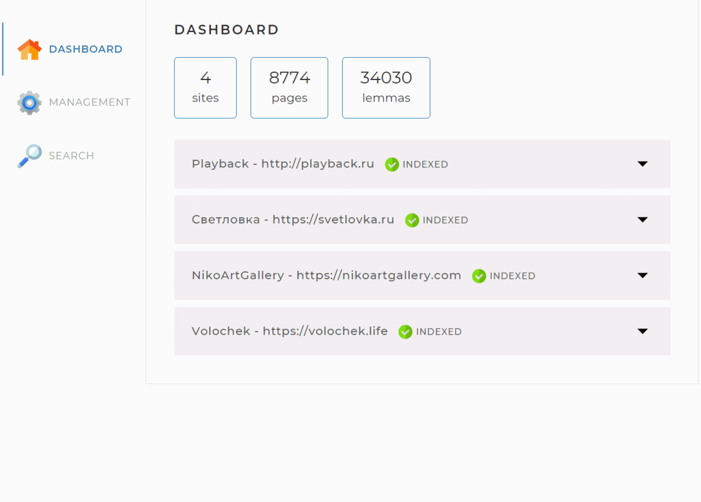

## Site Search Engine

The application to analyze the specified site (or several sites) to enable site searching

## Technologies

- **Java 17**
- **Spring Boot 2.7.1**
- **Maven**
- **MySQL**
- **Fork-Join Java Framework**
- **Apache Lucene Morphology**
- **JSOUP**
- **Lombok**

## How a search engine works

- the configuration file specifies the addresses of the sites to be searched for
- the search engine crawls all the pages of the specified sites and indexes them so that then it finds the most relevant pages for any search query
- the user sends search queries via the engine API
- the search query is transformed in a certain way into a list of words translated into the basic form, according to which pages are searched in the previously formed index
- the user gets ranked and sorted search results

## Application Interaction

The web interface of the application is implemented on one web page with three tabs:
- **dashboard** – shows statistics on sites

- **management** – contains indexing tools

- **search** – contains a search field and a drop-down list for selecting a site

## Launching the application

- install **Java 17+ and MySQL server**
- create an empty search_engine database. It is necessary to use utf8mb4 encoding
- download jar-file and configuration file
- indicate in the configuration file application.yaml database connection parameters in the spring.datasource section: username, password
- indicate in the configuration file application.yaml sites for indexing
- start application by running jar from command line: java -jar SearchEngine-1.0-SNAPSHOT.jar
- go to http://localhost:8080/ in the browser